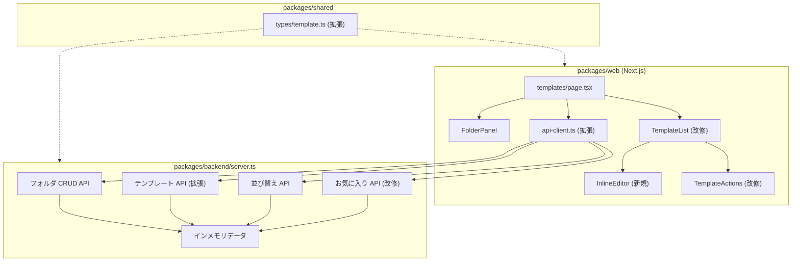
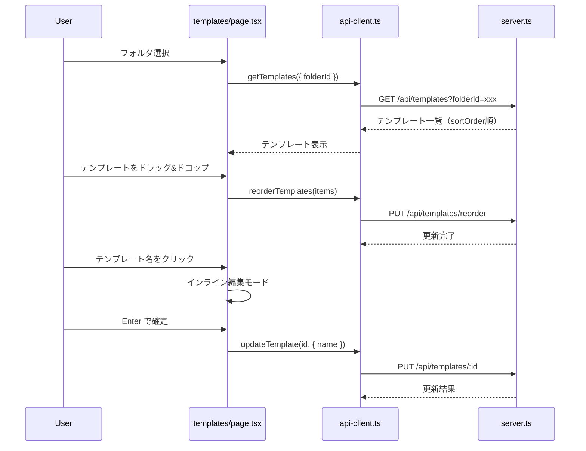

# 設計書: テンプレートフォルダ管理

## 概要

テンプレート管理画面（/templates）を大幅に改善し、フォルダによるテンプレート分類、ドラッグ&ドロップによる並び替え、お気に入り固定表示、インライン編集、および複製機能の修正を実装する。

既存のSMS送信機能（/api/sms/send, /api/sms/test-send, page.tsx）には一切変更を加えない。

### 技術スタック

- バックエンド: Express.js（packages/backend/server.ts、インメモリデータ）
- フロントエンド: Next.js（packages/web/）
- 共有型定義: packages/shared/src/types/template.ts
- ドラッグ&ドロップ: HTML5 Drag and Drop API（外部ライブラリ不使用）
- データストア: インメモリ（Prisma/DB不使用）

## アーキテクチャ

### システム構成



### データフロー



## コンポーネントとインターフェース

### バックエンド API エンドポイント（server.ts に追加）

#### フォルダ CRUD

| メソッド | パス | 説明 |
|---------|------|------|
| GET | /api/folders | フォルダ一覧取得 |
| POST | /api/folders | フォルダ作成 |
| PUT | /api/folders/:id | フォルダ名更新 |
| DELETE | /api/folders/:id | フォルダ削除（テンプレートのfolderIdをnullに） |

#### テンプレート拡張

| メソッド | パス | 説明 |
|---------|------|------|
| PUT | /api/templates/reorder | テンプレートの表示順一括更新 |
| GET | /api/templates | folderId クエリパラメータ追加 |
| PUT | /api/templates/:id | folderId, sortOrder フィールド追加 |
| POST | /api/templates/:id/duplicate | 複製（既存修正） |

#### お気に入り改修

| メソッド | パス | 説明 |
|---------|------|------|
| GET | /api/favorites | ユーザーのお気に入りID一覧取得 |
| POST | /api/templates/:id/favorite | お気に入りトグル（既存） |

### フロントエンド コンポーネント

#### 新規コンポーネント

1. **FolderPanel** (`packages/web/src/components/template/FolderPanel.tsx`)
   - フォルダ一覧表示（サイドバー形式）
   - フォルダ作成ボタン・インライン名前入力
   - フォルダ選択時のフィルタリング
   - フォルダ名編集・削除
   - 「すべて」「未分類」の特殊フィルタ

2. **InlineEditor** (`packages/web/src/components/template/InlineEditor.tsx`)
   - テンプレート名のインライン編集（クリックで入力フィールドに切替）
   - テンプレート本文のインライン編集（クリックでテキストエリアに切替）
   - Enter（名前）/ Ctrl+Enter（本文）で保存
   - Escape でキャンセル
   - `{{variable_name}}` バリデーション

#### 改修コンポーネント

3. **TemplateList** (`packages/web/src/components/template/TemplateList.tsx`)
   - ドラッグハンドル（⠿アイコン）追加
   - HTML5 Drag and Drop API によるドラッグ&ドロップ
   - 星アイコンを各行に直接表示
   - お気に入りセクション（上部固定）
   - フォルダ間ドラッグ&ドロップ対応
   - InlineEditor 統合

4. **TemplateActions** (`packages/web/src/components/template/TemplateActions.tsx`)
   - 「編集」ボタン削除（インライン編集に置換）
   - 複製ボタンの動作修正

5. **templates/page.tsx**
   - FolderPanel 統合（左サイドバー）
   - お気に入り状態の初期ロード
   - フォルダフィルタリング状態管理
   - 並び替え状態管理

### API クライアント拡張（api-client.ts）

```typescript
// フォルダ関連
export async function getFolders(): Promise<Folder[]>;
export async function createFolder(name: string): Promise<Folder>;
export async function updateFolder(id: string, name: string): Promise<Folder>;
export async function deleteFolder(id: string): Promise<{ success: boolean }>;

// テンプレート拡張
export async function reorderTemplates(
  items: Array<{ id: string; sortOrder: number; folderId?: string | null }>
): Promise<{ success: boolean }>;

// お気に入り
export async function getFavorites(): Promise<{ items: string[] }>;
```

## データモデル

### 共有型定義の拡張（packages/shared/src/types/template.ts）

```typescript
/** フォルダ */
export interface Folder {
  id: string;
  name: string;
  createdBy: string;
  createdAt: Date;
  updatedAt: Date;
}

/** フォルダ作成入力 */
export interface CreateFolderInput {
  name: string;
}

/** フォルダ更新入力 */
export interface UpdateFolderInput {
  name: string;
}
```

### Template インターフェースの拡張

既存の `Template` インターフェースに以下のフィールドを追加:

```typescript
export interface Template {
  // ... 既存フィールド
  folderId?: string | null;   // 所属フォルダID（nullは未分類）
  sortOrder?: number;          // 表示順（0始まり、小さいほど上）
}
```

### インメモリデータ構造（server.ts）

```typescript
// フォルダデータ
const folders: Array<{
  id: string;
  name: string;
  createdBy: string;
  createdAt: string;
  updatedAt: string;
}> = [];

// テンプレートデータ（既存配列に folderId, sortOrder を追加）
// 初期データは folderId: null, sortOrder: インデックス値

// お気に入りデータ（既存 Set をユーザー単位 Map に変更）
const favoritesByUser = new Map<string, Set<string>>();
```

### 並び替えリクエスト

```typescript
/** 並び替えリクエスト */
interface ReorderRequest {
  items: Array<{
    id: string;
    sortOrder: number;
    folderId?: string | null;
  }>;
}
```

### ドラッグ&ドロップ状態管理

```typescript
/** ドラッグ状態 */
interface DragState {
  draggedId: string | null;      // ドラッグ中のテンプレートID
  dragOverId: string | null;     // ドロップ先のテンプレートID
  dragOverFolder: string | null; // ドロップ先のフォルダID
}
```

### インライン編集状態管理

```typescript
/** インライン編集状態 */
interface InlineEditState {
  editingId: string | null;       // 編集中のテンプレートID
  editingField: 'name' | 'body' | null; // 編集中のフィールド
  editValue: string;              // 編集中の値
}
```

## 正当性プロパティ（Correctness Properties）

*プロパティとは、システムの全ての有効な実行において真であるべき特性や振る舞いのことである。人間が読める仕様と機械的に検証可能な正当性保証の橋渡しとなる形式的な記述である。*

### Property 1: テンプレート複製はフィールドを保持し名前に「(コピー)」を付与する

*For any* テンプレート、複製操作を実行した場合、生成されたテンプレートは元テンプレートの全フィールド（body, companyId, brand, purpose, department, visibility）を保持し、名前は元の名前 + "（コピー）" となること。IDとタイムスタンプは新規生成されること。

**Validates: Requirements 1.1, 1.4**

### Property 2: フォルダ作成の往復一貫性

*For any* 有効なフォルダ名、フォルダを作成した後にフォルダ一覧を取得すると、作成したフォルダが一覧に含まれ、名前が一致すること。

**Validates: Requirements 2.3**

### Property 3: フォルダ名更新の往復一貫性

*For any* 既存フォルダと有効な新しい名前、フォルダ名を更新した後にフォルダを取得すると、更新後の名前が返されること。

**Validates: Requirements 2.9**

### Property 4: フォルダフィルタリングの正確性

*For any* フォルダIDとテンプレート集合、フォルダIDでフィルタリングした結果には、そのフォルダに属するテンプレートのみが含まれ、他のフォルダのテンプレートは含まれないこと。

**Validates: Requirements 2.5**

### Property 5: フォルダ削除時のテンプレート保全

*For any* テンプレートを含むフォルダ、フォルダを削除した後、そのフォルダに属していた全テンプレートのfolderIdがnullになり、テンプレート自体は削除されずに存在し続けること。

**Validates: Requirements 2.7**

### Property 6: テンプレート移動とソート順の同時更新

*For any* テンプレートとフォルダ、reorder APIでfolderIdとsortOrderを指定して更新した後にテンプレートを取得すると、folderIdとsortOrderの両方が指定した値に更新されていること。

**Validates: Requirements 2.6, 3.2, 3.3, 3.5**

### Property 7: お気に入りトグルの往復一貫性

*For any* テンプレート、お気に入りをトグルした後にお気に入り一覧を取得すると、そのテンプレートが一覧に含まれること。再度トグルすると一覧から除外されること。

**Validates: Requirements 4.1, 4.4**

### Property 8: お気に入りのユーザースコープ独立性

*For any* 2人の異なるユーザーとテンプレート、ユーザーAがお気に入りに追加しても、ユーザーBのお気に入り一覧には影響しないこと。

**Validates: Requirements 4.5**

### Property 9: インライン編集の保存往復一貫性

*For any* テンプレートと有効な新しい名前または本文、updateTemplate APIで更新した後にテンプレートを取得すると、更新した値が返されること。

**Validates: Requirements 5.3**

### Property 10: 変数フォーマットバリデーション

*For any* 文字列、`{{variable_name}}` パターンに一致する変数は有効と判定され、不正なフォーマット（`{variable}`, `{{}}`, `{{ }}`）は無効と判定されること。

**Validates: Requirements 5.8**

## エラーハンドリング

### バックエンド

| エラー条件 | HTTPステータス | エラーコード | メッセージ |
|-----------|--------------|------------|----------|
| テンプレートが見つからない | 404 | NOT_FOUND | テンプレートが見つかりません |
| フォルダが見つからない | 404 | NOT_FOUND | フォルダが見つかりません |
| フォルダ名が空 | 400 | VALIDATION_ERROR | フォルダ名は必須です |
| 並び替えデータが不正 | 400 | VALIDATION_ERROR | 並び替えデータが不正です |
| 複製対象が存在しない | 404 | NOT_FOUND | テンプレートが見つかりません |

### フロントエンド

| エラー条件 | 表示方法 |
|-----------|---------|
| API通信エラー | ページ上部にエラーバナー表示 |
| インライン編集の保存失敗 | エラーメッセージ表示、編集内容を保持 |
| 変数フォーマット不正 | インラインエディタ下部にバリデーションエラー表示 |
| フォルダ操作失敗 | エラーバナー表示 |

## テスト戦略

### テストアプローチ

ユニットテストとプロパティベーステストの二重アプローチを採用する。

- **ユニットテスト**: 具体的な例、エッジケース、エラー条件の検証
- **プロパティベーステスト**: 全入力に対する普遍的プロパティの検証

### プロパティベーステスト

**ライブラリ**: [fast-check](https://github.com/dubzzz/fast-check)（TypeScript向けPBTライブラリ）

**設定**:
- 各プロパティテストは最低100回のイテレーションを実行
- 各テストにはデザインドキュメントのプロパティ番号をコメントで参照
- タグフォーマット: `Feature: template-folder-management, Property {number}: {property_text}`
- 各正当性プロパティは1つのプロパティベーステストで実装

### ユニットテスト

- 複製ボタンの動作確認（具体的なテンプレートでの複製結果）
- 存在しないテンプレートの複製エラー
- フォルダCRUDの基本操作
- ドラッグ&ドロップ後の表示順確認
- インライン編集のEscapeキャンセル動作
- 「編集」ボタンが削除されていることの確認
- お気に入りセクションの表示/非表示
- 空フォルダ名のバリデーション

### テスト対象外

- SMS送信機能（変更対象外のため）
- UIの視覚的なスタイリング（ハイライト色、アニメーション等）
- ブラウザ固有のDrag and Drop API動作
