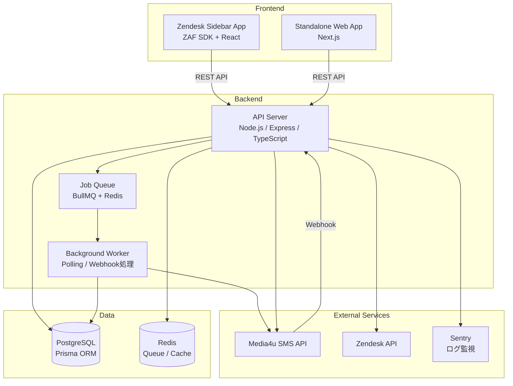
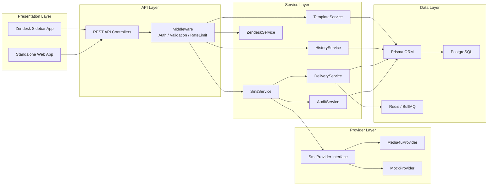
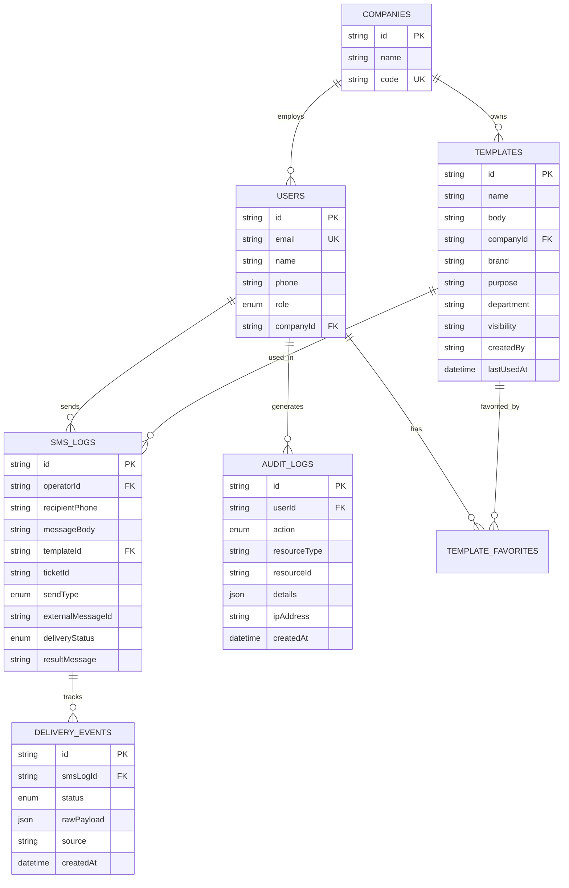
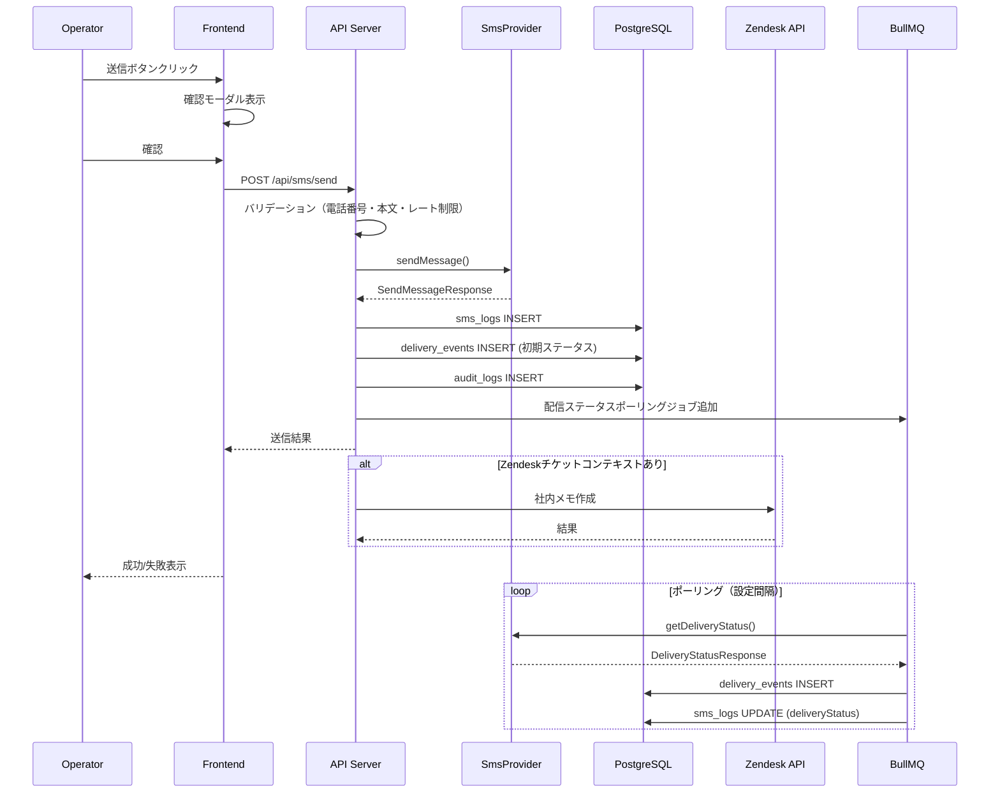

# Design Document: Zendesk SMS Tool

## Overview

Zendesk連携型SMS送信・管理ツールは、Zendeskサポート業務においてオペレーターが顧客へSMSを効率的に送信し、送信履歴を管理するシステムである。本システムは2つのフロントエンドモード（Zendeskサイドバーアプリ + 独立Webアプリ）と共通バックエンドで構成される。

### 主要な設計判断

1. **モノレポ構成**: フロントエンド（Next.js）とバックエンド（Node.js/Express）を同一リポジトリで管理し、型定義を共有する
2. **SMSプロバイダ抽象化**: Strategy パターンで SMS プロバイダを差し替え可能にし、Media4u と MockProvider を実装する
3. **Zendesk連携**: ZAF SDK を使用してサイドバーアプリとして動作し、チケット情報を自動取得する
4. **非同期処理**: 配信ステータスのポーリングや Webhook 処理は BullMQ を使用してバックグラウンドで実行する
5. **段階的リリース**: Phase 1（基本SMS送信・テンプレ利用・Zendesk連携）→ Phase 2（テンプレ管理強化・到達確認・テスト送信）→ Phase 3（自動送信・承認フロー・分析）

### システム構成図



## Architecture

### High-Level Architecture

本システムは以下のレイヤーで構成される：



### Low-Level Architecture

#### ディレクトリ構成

```
zendesk-sms-tool/
├── packages/
│   ├── shared/                    # 共有型定義・バリデーション
│   │   ├── src/
│   │   │   ├── types/             # 共通型定義
│   │   │   │   ├── sms.ts
│   │   │   │   ├── template.ts
│   │   │   │   ├── delivery.ts
│   │   │   │   ├── user.ts
│   │   │   │   └── audit.ts
│   │   │   ├── validators/        # 共通バリデーション
│   │   │   │   ├── phone.ts
│   │   │   │   └── template.ts
│   │   │   └── constants.ts
│   │   └── package.json
│   ├── backend/                   # API サーバー
│   │   ├── src/
│   │   │   ├── controllers/
│   │   │   ├── services/
│   │   │   ├── providers/
│   │   │   ├── middleware/
│   │   │   ├── jobs/
│   │   │   ├── prisma/
│   │   │   │   └── schema.prisma
│   │   │   └── app.ts
│   │   └── package.json
│   ├── web/                       # Standalone Web App (Next.js)
│   │   ├── src/
│   │   │   ├── app/
│   │   │   ├── components/
│   │   │   ├── hooks/
│   │   │   └── lib/
│   │   └── package.json
│   └── zendesk/                   # Zendesk Sidebar App
│       ├── src/
│       │   ├── components/
│       │   ├── hooks/
│       │   └── zaf/
│       └── package.json
├── package.json                   # Workspace root
└── turbo.json
```

## Components and Interfaces

### 1. SMS Provider Interface（プロバイダ抽象化層）

```typescript
// packages/shared/src/types/sms.ts

type DeliveryStatus = 'queued' | 'sent' | 'delivered' | 'failed' | 'expired' | 'unknown';

interface SendMessageRequest {
  to: string;           // E.164 or domestic format
  body: string;
  metadata?: Record<string, string>;
}

interface SendMessageResponse {
  success: boolean;
  externalMessageId?: string;
  status: DeliveryStatus;
  error?: { code: string; message: string };
}

interface DeliveryStatusResponse {
  externalMessageId: string;
  status: DeliveryStatus;
  updatedAt: Date;
  rawResponse?: unknown;
}

interface SmsProvider {
  sendMessage(req: SendMessageRequest): Promise<SendMessageResponse>;
  getDeliveryStatus(externalMessageId: string): Promise<DeliveryStatusResponse>;
  validateConfig(): Promise<{ valid: boolean; errors: string[] }>;
}
```

#### Media4uProvider

```typescript
// packages/backend/src/providers/media4u-provider.ts

class Media4uProvider implements SmsProvider {
  constructor(private config: Media4uConfig) {}

  async sendMessage(req: SendMessageRequest): Promise<SendMessageResponse> {
    // Media4u API へ HTTP リクエスト送信
    // レスポンスを SendMessageResponse に変換
  }

  async getDeliveryStatus(externalMessageId: string): Promise<DeliveryStatusResponse> {
    // Media4u 配信ステータス API を呼び出し
  }

  async validateConfig(): Promise<{ valid: boolean; errors: string[] }> {
    // API キー・エンドポイントの疎通確認
  }
}
```

#### MockProvider（開発・テスト用）

```typescript
// packages/backend/src/providers/mock-provider.ts

class MockProvider implements SmsProvider {
  private sentMessages: Map<string, SendMessageResponse> = new Map();

  async sendMessage(req: SendMessageRequest): Promise<SendMessageResponse> {
    // メモリ内に保存、常に成功を返す（設定で失敗シミュレーション可能）
  }

  async getDeliveryStatus(externalMessageId: string): Promise<DeliveryStatusResponse> {
    // メモリ内のステータスを返す
  }

  async validateConfig(): Promise<{ valid: boolean; errors: string[] }> {
    return { valid: true, errors: [] };
  }
}
```

### 2. SmsService（SMS送信サービス）

```typescript
// packages/backend/src/services/sms-service.ts

class SmsService {
  constructor(
    private provider: SmsProvider,
    private historyService: HistoryService,
    private auditService: AuditService,
    private deliveryService: DeliveryService,
  ) {}

  async send(params: {
    operatorId: string;
    to: string;
    body: string;
    templateId?: string;
    ticketId?: string;
    sendType: 'customer' | 'self_copy' | 'test';
  }): Promise<SendResult> {
    // 1. 電話番号バリデーション
    // 2. レート制限チェック
    // 3. SMS_Provider.sendMessage() 呼び出し
    // 4. sms_logs に記録
    // 5. delivery_events に初期ステータス記録
    // 6. audit_logs に記録
    // 7. 配信ステータスポーリングジョブをキューに追加
  }

  async sendWithSelfCopy(params: SendParams): Promise<SendWithCopyResult> {
    // 1. 顧客向け送信
    // 2. 自分向け送信（失敗しても顧客送信は成功扱い）
    // 3. 両方の結果を返す
  }

  async testSend(params: TestSendParams): Promise<SendResult> {
    // 1. メッセージ本文に "[TEST]" プレフィックス追加
    // 2. テスト用電話番号に送信
    // 3. sendType: 'test' で記録
  }
}
```

### 3. TemplateService（テンプレート管理サービス）

```typescript
// packages/backend/src/services/template-service.ts

class TemplateService {
  async create(data: CreateTemplateInput): Promise<Template>;
  async update(id: string, data: UpdateTemplateInput): Promise<Template>;
  async delete(id: string): Promise<void>;
  async findById(id: string): Promise<Template | null>;
  async search(query: TemplateSearchQuery): Promise<Template[]>;
  async duplicate(id: string, newName: string): Promise<Template>;
  async toggleFavorite(templateId: string, userId: string): Promise<void>;

  // テンプレート変数展開
  parseVariables(templateBody: string): string[];
  renderTemplate(templateBody: string, variables: Record<string, string>): RenderResult;
  validateVariableFormat(templateBody: string): ValidationResult;
}
```

#### テンプレート変数展開ロジック

```typescript
// packages/shared/src/validators/template.ts

const VARIABLE_PATTERN = /\{\{(\w+)\}\}/g;

const SUPPORTED_VARIABLES = [
  'customer_name', 'phone', 'ticket_id', 'agent_name',
  'company_name', 'today', 'support_email', 'short_url',
] as const;

function parseVariables(body: string): string[] {
  const matches = body.matchAll(VARIABLE_PATTERN);
  return [...matches].map(m => m[1]);
}

function renderTemplate(
  body: string,
  values: Record<string, string>,
): { rendered: string; unresolvedVars: string[] } {
  const unresolvedVars: string[] = [];
  const rendered = body.replace(VARIABLE_PATTERN, (match, varName) => {
    if (values[varName] !== undefined && values[varName] !== '') {
      return values[varName];
    }
    unresolvedVars.push(varName);
    return match; // 未解決の変数はそのまま残す
  });
  return { rendered, unresolvedVars };
}
```

### 4. DeliveryService（配信追跡サービス）

```typescript
// packages/backend/src/services/delivery-service.ts

class DeliveryService {
  constructor(
    private provider: SmsProvider,
    private queue: Queue,
  ) {}

  async recordInitialStatus(logId: string, status: DeliveryStatus): Promise<void>;
  async updateStatus(externalMessageId: string, newStatus: DeliveryStatus): Promise<void>;
  async processWebhook(payload: WebhookPayload): Promise<void>;
  async schedulePolling(externalMessageId: string, logId: string): Promise<void>;
  async getStatusHistory(logId: string): Promise<DeliveryEvent[]>;
}
```

### 5. ZendeskService（Zendesk連携サービス）

```typescript
// packages/backend/src/services/zendesk-service.ts

class ZendeskService {
  async getTicketContext(ticketId: string): Promise<TicketContext>;
  async createInternalNote(ticketId: string, note: InternalNoteData): Promise<void>;
  formatInternalNote(data: InternalNoteData): string;
}

interface InternalNoteData {
  destinationPhone: string;
  sendType: string;
  templateName?: string;
  messageBody: string;
  senderName: string;
  sendTimestamp: Date;
  sendResult: string;
  deliveryStatus: DeliveryStatus;
  externalMessageId?: string;
}
```

### 6. HistoryService（履歴管理サービス）

```typescript
// packages/backend/src/services/history-service.ts

class HistoryService {
  async search(query: HistorySearchQuery): Promise<PaginatedResult<SmsLog>>;
  async getById(id: string): Promise<SmsLog | null>;
  async exportCsv(query: HistorySearchQuery): Promise<Buffer>;
}

interface HistorySearchQuery {
  ticketId?: string;
  phone?: string;
  operatorId?: string;
  templateId?: string;
  dateFrom?: Date;
  dateTo?: Date;
  deliveryStatus?: DeliveryStatus;
  page?: number;
  limit?: number;
}
```

### 7. AuditService（監査ログサービス）

```typescript
// packages/backend/src/services/audit-service.ts

class AuditService {
  async log(entry: AuditLogEntry): Promise<void>;
  async search(query: AuditSearchQuery): Promise<PaginatedResult<AuditLog>>;
}

interface AuditLogEntry {
  userId: string;
  action: AuditAction;
  resourceType: string;
  resourceId?: string;
  details: Record<string, unknown>;
  ipAddress?: string;
}

type AuditAction =
  | 'sms_send' | 'sms_send_failed'
  | 'template_create' | 'template_update' | 'template_delete'
  | 'permission_denied'
  | 'config_change';
```

### 8. API Endpoints

#### テンプレート系

| Method | Path | Description | Auth |
|--------|------|-------------|------|
| GET | `/api/templates` | テンプレート一覧取得 | Operator+ |
| POST | `/api/templates` | テンプレート作成 | Operator+ |
| PUT | `/api/templates/:id` | テンプレート更新 | Supervisor+ |
| DELETE | `/api/templates/:id` | テンプレート削除 | Supervisor+ |
| GET | `/api/templates/search` | テンプレート検索 | Operator+ |
| POST | `/api/templates/:id/duplicate` | テンプレート複製 | Operator+ |
| POST | `/api/templates/:id/favorite` | お気に入りトグル | Operator+ |

#### SMS送信系

| Method | Path | Description | Auth |
|--------|------|-------------|------|
| POST | `/api/sms/send` | SMS送信 | Operator+ |
| POST | `/api/sms/test-send` | テスト送信 | Supervisor+ |
| POST | `/api/sms/send-self-copy` | 自分にも送信付きSMS送信 | Operator+ |

#### 配信確認系

| Method | Path | Description | Auth |
|--------|------|-------------|------|
| GET | `/api/sms/logs` | 送信履歴一覧 | Operator+ |
| GET | `/api/sms/logs/:id` | 送信履歴詳細 | Operator+ |
| GET | `/api/sms/delivery-status/:id` | 配信ステータス取得 | Operator+ |
| POST | `/api/sms/webhook/delivery` | 配信Webhook受信 | Internal |

#### Zendesk連携系

| Method | Path | Description | Auth |
|--------|------|-------------|------|
| POST | `/api/zendesk/internal-note` | 社内メモ作成 | Operator+ |
| GET | `/api/zendesk/ticket/:id/context` | チケット情報取得 | Operator+ |

#### 管理系

| Method | Path | Description | Auth |
|--------|------|-------------|------|
| GET | `/api/companies` | 企業一覧取得 | Operator+ |
| GET | `/api/users/me` | 自分の情報取得 | Operator+ |
| GET | `/api/settings` | 設定取得 | System_Admin |
| PUT | `/api/settings` | 設定更新 | System_Admin |

### 9. Middleware

```typescript
// 認証ミドルウェア
function authMiddleware(req, res, next): void;

// 権限チェックミドルウェア
function requireRole(...roles: UserRole[]): Middleware;

// レート制限ミドルウェア（Requirement 10.4: 10 sends/min/operator）
function rateLimitMiddleware(config: RateLimitConfig): Middleware;

// バリデーションミドルウェア
function validateBody(schema: ZodSchema): Middleware;
```

### 10. フロントエンド共通コンポーネント

Zendesk サイドバーアプリと Standalone Web アプリで共有するコアコンポーネント：

```
packages/web/src/components/
├── SmsComposer/          # メッセージ入力・送信UI
│   ├── PhoneInput.tsx    # 電話番号入力（バリデーション付き）
│   ├── MessageEditor.tsx # メッセージ編集エリア
│   ├── SendButton.tsx    # 送信ボタン（確認モーダル付き）
│   └── SendResult.tsx    # 送信結果表示
├── TemplateSelector/     # テンプレート選択・検索
│   ├── TemplateList.tsx
│   ├── TemplateSearch.tsx
│   └── TemplatePreview.tsx
├── HistoryPanel/         # 送信履歴パネル
│   ├── HistoryTable.tsx
│   ├── HistoryFilter.tsx
│   └── HistoryExport.tsx
├── TicketInfo/           # チケット情報表示
│   └── TicketHeader.tsx
└── ConfirmModal/         # 送信確認モーダル
    └── ConfirmModal.tsx
```

## Data Models

### Prisma Schema

```prisma
// packages/backend/src/prisma/schema.prisma

generator client {
  provider = "prisma-client-js"
}

datasource db {
  provider = "postgresql"
  url      = env("DATABASE_URL")
}

enum UserRole {
  OPERATOR
  SUPERVISOR
  SYSTEM_ADMIN
}

enum SendType {
  CUSTOMER
  SELF_COPY
  TEST
}

enum DeliveryStatus {
  QUEUED
  SENT
  DELIVERED
  FAILED
  EXPIRED
  UNKNOWN
}

enum AuditAction {
  SMS_SEND
  SMS_SEND_FAILED
  TEMPLATE_CREATE
  TEMPLATE_UPDATE
  TEMPLATE_DELETE
  PERMISSION_DENIED
  CONFIG_CHANGE
}

model User {
  id          String    @id @default(cuid())
  email       String    @unique
  name        String
  phone       String?
  role        UserRole  @default(OPERATOR)
  companyId   String?
  company     Company?  @relation(fields: [companyId], references: [id])
  smsLogs     SmsLog[]
  auditLogs   AuditLog[]
  favorites   TemplateFavorite[]
  createdAt   DateTime  @default(now())
  updatedAt   DateTime  @updatedAt

  @@map("users")
}

model Company {
  id        String     @id @default(cuid())
  name      String
  code      String     @unique
  users     User[]
  templates Template[]
  createdAt DateTime   @default(now())
  updatedAt DateTime   @updatedAt

  @@map("companies")
}

model Template {
  id          String    @id @default(cuid())
  name        String
  body        String
  companyId   String?
  company     Company?  @relation(fields: [companyId], references: [id])
  brand       String?
  purpose     String?
  department  String?
  visibility  String    @default("company") // "company" | "personal" | "global"
  createdBy   String
  lastUsedAt  DateTime?
  smsLogs     SmsLog[]
  favorites   TemplateFavorite[]
  createdAt   DateTime  @default(now())
  updatedAt   DateTime  @updatedAt

  @@index([companyId, purpose])
  @@index([name])
  @@map("templates")
}

model TemplateFavorite {
  id         String   @id @default(cuid())
  userId     String
  templateId String
  user       User     @relation(fields: [userId], references: [id])
  template   Template @relation(fields: [templateId], references: [id], onDelete: Cascade)
  createdAt  DateTime @default(now())

  @@unique([userId, templateId])
  @@map("template_favorites")
}

model SmsLog {
  id                String          @id @default(cuid())
  operatorId        String
  operator          User            @relation(fields: [operatorId], references: [id])
  recipientPhone    String
  messageBody       String
  templateId        String?
  template          Template?       @relation(fields: [templateId], references: [id])
  ticketId          String?
  sendType          SendType
  externalMessageId String?
  deliveryStatus    DeliveryStatus  @default(QUEUED)
  resultMessage     String?
  deliveryEvents    DeliveryEvent[]
  createdAt         DateTime        @default(now())
  updatedAt         DateTime        @updatedAt

  @@index([ticketId])
  @@index([recipientPhone])
  @@index([operatorId])
  @@index([createdAt])
  @@index([deliveryStatus])
  @@map("sms_logs")
}

model DeliveryEvent {
  id                String         @id @default(cuid())
  smsLogId          String
  smsLog            SmsLog         @relation(fields: [smsLogId], references: [id])
  status            DeliveryStatus
  rawPayload        Json?
  source            String         // "api_response" | "polling" | "webhook"
  createdAt         DateTime       @default(now())

  @@index([smsLogId])
  @@map("delivery_events")
}

model AuditLog {
  id           String      @id @default(cuid())
  userId       String
  user         User        @relation(fields: [userId], references: [id])
  action       AuditAction
  resourceType String
  resourceId   String?
  details      Json
  ipAddress    String?
  createdAt    DateTime    @default(now())

  @@index([userId])
  @@index([action])
  @@index([createdAt])
  @@map("audit_logs")
}
```

### ER図



### データフロー

#### SMS送信フロー



## Correctness Properties

*A property is a characteristic or behavior that should hold true across all valid executions of a system—essentially, a formal statement about what the system should do. Properties serve as the bridge between human-readable specifications and machine-verifiable correctness guarantees.*

### Property 1: Japanese mobile phone number validation

*For any* string, the phone number validator should accept it if and only if it matches the Japanese mobile phone format (starts with 070, 080, or 090 and is exactly 11 digits). All other strings should be rejected.

**Validates: Requirements 1.4, 10.1**

### Property 2: SMS send result structure

*For any* valid send request (valid phone number and non-empty body), when the SMS provider returns a successful response, the send result should contain the external message ID and a success status. When the provider returns an error, the send result should contain the specific failure reason.

**Validates: Requirements 1.1, 1.2, 1.3**

### Property 3: Empty or whitespace message rejection

*For any* string composed entirely of whitespace characters (including the empty string), the SMS sender should reject the submission and return a validation error. The SMS log count should remain unchanged.

**Validates: Requirements 1.5**

### Property 4: Template CRUD round-trip

*For any* valid template data, creating a template and then reading it back by ID should produce an equivalent template with matching name, body, company, brand, purpose, department, and visibility fields.

**Validates: Requirements 2.1**

### Property 5: Template classification preservation

*For any* template with any combination of classification fields (company, brand, purpose, department, visibility), storing and retrieving the template should preserve all classification values exactly.

**Validates: Requirements 2.2**

### Property 6: Template search returns matching results

*For any* keyword search query, all returned templates should contain the keyword in at least one of their searchable fields (name, body, purpose, brand).

**Validates: Requirements 2.3**

### Property 7: Template variable format validation

*For any* template body string, the validator should identify all placeholder patterns. Valid patterns matching `{{variable_name}}` (word characters only) should be accepted, and any malformed patterns (e.g., `{{}}`, `{{ }}`, `{{123abc}}` with leading digits) should be flagged as invalid.

**Validates: Requirements 2.7**

### Property 8: Template variable parsing extracts all variables

*For any* template body string containing N distinct `{{variable_name}}` patterns, the parser should return exactly N variable names, and each variable name should correspond to a pattern in the original string.

**Validates: Requirements 3.4**

### Property 9: Template parse-render-parse round-trip

*For any* valid template body, parsing the template to extract variables, rendering it with identity values (where each variable maps to itself wrapped in `{{}}`), and parsing again should produce the same list of variables.

**Validates: Requirements 3.5**

### Property 10: Unresolved variable detection

*For any* template with K variables and a values map missing M of those variables (M > 0), the render result should list exactly those M variables as unresolved, and the rendered text should still contain the original `{{variable_name}}` placeholders for the missing values.

**Validates: Requirements 3.3**

### Property 11: Template rendering replaces all provided variables

*For any* template body and a complete values map (all variables have non-empty values), the rendered output should not contain any `{{variable_name}}` patterns, and each variable's value should appear in the rendered text.

**Validates: Requirements 3.2**

### Property 12: SMS log sendType matches operation type

*For any* SMS send operation, the resulting SMS log entry's sendType field should match the operation: 'customer' for regular sends, 'self_copy' for self-copy sends, and 'test' for test sends.

**Validates: Requirements 4.2, 4.3, 5.2**

### Property 13: Self-copy sends identical message body

*For any* SMS send with self-copy enabled, the provider should receive two send requests where the message body is identical, and the destinations are the customer phone number and the operator's registered phone number respectively.

**Validates: Requirements 4.1**

### Property 14: Test send uses configured test number and [TEST] prefix

*For any* test send operation, the message sent to the provider should have the destination set to the configured test phone number (not the customer number), and the message body should start with "[TEST]".

**Validates: Requirements 5.1, 5.4**

### Property 15: Delivery status events logged with timestamps

*For any* delivery status change (whether from initial send, polling, or webhook), a delivery_event record should be created with the new status, a source identifier, and a timestamp. The sms_log's deliveryStatus should reflect the latest status.

**Validates: Requirements 6.2, 6.6**

### Property 16: Webhook delivery status update

*For any* valid webhook payload containing an external message ID and a new delivery status, processing the webhook should create a new delivery_event and update the corresponding sms_log's deliveryStatus.

**Validates: Requirements 6.4**

### Property 17: History filter returns only matching results

*For any* combination of filter criteria (ticketId, phone, operatorId, templateId, dateRange, deliveryStatus), all returned SMS log entries should satisfy every specified filter condition.

**Validates: Requirements 9.1**

### Property 18: CSV export round-trip

*For any* set of SMS log entries, exporting to CSV and parsing the CSV back should produce records with equivalent field values for all exported columns.

**Validates: Requirements 9.3**

### Property 19: SMS log completeness

*For any* SMS send operation, the resulting SMS log entry should contain the complete message body (not truncated) and a valid operator ID matching the sender.

**Validates: Requirements 9.4, 9.5**

### Property 20: Dangerous keyword detection

*For any* message body containing at least one predefined dangerous keyword, the keyword detector should flag the message. For any message body containing none of the dangerous keywords, the detector should not flag it.

**Validates: Requirements 10.2**

### Property 21: Rate limit enforcement

*For any* operator, if they have sent 10 or more messages within the current 1-minute window, the next send attempt should be rejected with a rate limit error.

**Validates: Requirements 10.4**

### Property 22: Duplicate send warning

*For any* operator attempting to send to a phone number that was already sent to within the last 5 minutes, the system should return a duplicate send warning.

**Validates: Requirements 10.5**

### Property 23: Role-based permission enforcement

*For any* user with a given role and any action, the authorization check should permit the action if and only if the action is within the role's allowed permissions. The role hierarchy (Operator ⊂ Supervisor ⊂ System_Admin) should be strictly enforced, and denied attempts should produce an audit log entry.

**Validates: Requirements 11.2, 11.3, 11.4, 11.5**

### Property 24: Provider send-then-status consistency

*For any* SMS provider implementation, after a successful sendMessage() call, calling getDeliveryStatus() with the returned external message ID should return a valid DeliveryStatus value (one of: queued, sent, delivered, failed, expired, unknown).

**Validates: Requirements 12.5**

### Property 25: Internal note formatting completeness

*For any* InternalNoteData object, the formatted internal note string should contain all required fields: destination phone number, send type, template name, message body, sender name, send timestamp, send result, delivery status, and external message ID.

**Validates: Requirements 8.1, 8.2, 8.4**

### Property 26: Audit log entries contain required fields

*For any* audit log entry, the entry should contain a timestamp, user ID, and action type. Additionally, for SMS_SEND actions it should contain recipient number, message content, and result status. For TEMPLATE_* actions it should contain before/after values. For PERMISSION_DENIED actions it should contain the attempted action.

**Validates: Requirements 14.1, 14.2, 14.3**

### Property 27: Audit log serialization round-trip

*For any* valid audit log entry, serializing to JSON and deserializing back should produce an equivalent log entry with all fields preserved.

**Validates: Requirements 14.6**

### Property 28: Provider configuration validation

*For any* SMS provider configuration, validateConfig() should return valid=true only when all required configuration fields are present and correctly formatted. Missing or malformed fields should result in valid=false with descriptive error messages.

**Validates: Requirements 12.4**

## Error Handling

### エラー分類

| カテゴリ | 例 | 対応方針 |
|---------|---|---------|
| バリデーションエラー | 電話番号不正、空メッセージ、テンプレート変数不正 | 即座にユーザーへフィードバック、送信ブロック |
| プロバイダエラー | Media4u API タイムアウト、認証失敗、レート制限 | リトライ（指数バックオフ）、ユーザーへエラー表示、Sentry通知 |
| Zendesk連携エラー | チケット情報取得失敗、社内メモ作成失敗 | SMS送信はロールバックしない、警告表示、Sentry通知 |
| 認証・認可エラー | 未認証、権限不足 | リクエスト拒否、監査ログ記録 |
| レート制限エラー | 1分10件超過、重複送信 | 送信ブロック、警告表示 |
| データベースエラー | 接続失敗、書き込みエラー | リトライ、Sentry通知、ユーザーへ一般エラー表示 |
| 配信追跡エラー | ポーリング失敗、Webhook処理失敗 | リトライ（BullMQのリトライ機構）、ステータスを'unknown'に |

### エラーレスポンス形式

```typescript
interface ApiErrorResponse {
  error: {
    code: string;        // e.g., "VALIDATION_ERROR", "PROVIDER_ERROR"
    message: string;     // ユーザー向けメッセージ
    details?: Record<string, string>; // フィールド別エラー詳細
  };
  requestId: string;     // トレーシング用
}
```

### リトライ戦略

```typescript
// BullMQ ジョブリトライ設定
const deliveryPollingJobOptions = {
  attempts: 5,
  backoff: {
    type: 'exponential',
    delay: 30_000, // 30秒から開始
  },
};

// SMS プロバイダリトライ設定
const providerRetryConfig = {
  maxRetries: 3,
  initialDelay: 1_000,
  maxDelay: 10_000,
  retryableErrors: ['TIMEOUT', 'RATE_LIMITED', 'SERVICE_UNAVAILABLE'],
};
```

### Sentry統合

```typescript
// エラー重要度分類
// Critical: SMS送信失敗（プロバイダエラー）、DB接続失敗
// Warning: Zendesk社内メモ作成失敗、配信ステータスポーリング失敗
// Info: バリデーションエラー、レート制限発動、権限拒否
```

## Testing Strategy

### テスト構成

本プロジェクトでは、ユニットテストとプロパティベーステストの2つのアプローチを併用する。

#### ユニットテスト

- フレームワーク: **Vitest**
- 対象: 具体的な入出力例、エッジケース、エラー条件、統合ポイント
- 主なテスト対象:
  - 各サービスの基本動作（具体的な入力値での動作確認）
  - エッジケース: 自分送信の部分失敗（Req 4.4）、Zendesk社内メモ作成失敗（Req 8.3）
  - サポートされる変数リストの確認（Req 3.1）
  - 配信ステータスの有効値確認（Req 6.1）
  - ロール定義の確認（Req 11.1）
  - ZAF SDK からのチケットID取得（Req 7.1）
  - API エンドポイントの統合テスト

#### プロパティベーステスト

- ライブラリ: **fast-check**（TypeScript向けプロパティベーステストライブラリ）
- 各テスト最低100イテレーション実行
- 各テストにデザインドキュメントのプロパティ番号をタグ付け
- タグ形式: `Feature: zendesk-sms-tool, Property {number}: {property_text}`

#### プロパティテスト実装方針

| Property | テスト概要 | 主要ジェネレータ |
|----------|----------|----------------|
| P1 | 電話番号バリデーション | `fc.string()`, `fc.stringOf(fc.constantFrom('0'-'9'))` |
| P2 | SMS送信結果構造 | `fc.record({to: validPhone, body: nonEmptyString})` |
| P3 | 空白メッセージ拒否 | `fc.stringOf(fc.constantFrom(' ', '\t', '\n', '\r'))` |
| P4 | テンプレートCRUDラウンドトリップ | `fc.record({name, body, company, ...})` |
| P5 | テンプレート分類保存 | `fc.record({company, brand, purpose, department, visibility})` |
| P6 | テンプレート検索一致 | `fc.string()` for keyword, template list |
| P7 | テンプレート変数フォーマット検証 | `fc.string()` with embedded `{{...}}` patterns |
| P8 | テンプレート変数パース | Template body with N `{{var}}` patterns |
| P9 | テンプレートparse-renderラウンドトリップ | Valid template bodies |
| P10 | 未解決変数検出 | Template + partial values map |
| P11 | テンプレートレンダリング完全展開 | Template + complete values map |
| P12 | SMS log sendType一致 | Send operations with different types |
| P13 | 自分送信同一メッセージ | `fc.record({body, customerPhone, operatorPhone})` |
| P14 | テスト送信番号・プレフィックス | `fc.record({body, testPhone})` |
| P15 | 配信ステータスイベント記録 | Status transitions |
| P16 | Webhook配信ステータス更新 | Webhook payloads |
| P17 | 履歴フィルタ一致 | Filter criteria + SMS log data |
| P18 | CSVエクスポートラウンドトリップ | SMS log entries |
| P19 | SMSログ完全性 | Send operations |
| P20 | 危険キーワード検出 | Message bodies with/without keywords |
| P21 | レート制限 | Send sequences |
| P22 | 重複送信警告 | Send pairs with timing |
| P23 | ロールベース権限 | `fc.constantFrom('OPERATOR', 'SUPERVISOR', 'SYSTEM_ADMIN')` + actions |
| P24 | プロバイダsend-then-status | Valid send requests |
| P25 | 社内メモフォーマット完全性 | `fc.record({...InternalNoteData fields})` |
| P26 | 監査ログフィールド完全性 | Audit entries by action type |
| P27 | 監査ログシリアライゼーションラウンドトリップ | Audit log entries |
| P28 | プロバイダ設定検証 | Config objects with missing/valid fields |

#### テスト実行

```bash
# ユニットテスト
npx vitest --run

# プロパティベーステスト（100イテレーション以上）
npx vitest --run --testPathPattern="*.property.test.ts"

# 全テスト
npx vitest --run
```

### テストディレクトリ構成

```
packages/backend/src/
├── services/__tests__/
│   ├── sms-service.test.ts           # ユニットテスト
│   ├── sms-service.property.test.ts  # プロパティテスト (P2, P3, P12, P13, P14, P19)
│   ├── template-service.test.ts
│   ├── template-service.property.test.ts  # (P4, P5, P6)
│   ├── delivery-service.test.ts
│   ├── delivery-service.property.test.ts  # (P15, P16)
│   ├── history-service.test.ts
│   ├── history-service.property.test.ts   # (P17, P18)
│   ├── zendesk-service.test.ts
│   ├── zendesk-service.property.test.ts   # (P25)
│   ├── audit-service.test.ts
│   └── audit-service.property.test.ts     # (P26, P27)
├── validators/__tests__/
│   ├── phone.test.ts
│   ├── phone.property.test.ts             # (P1)
│   ├── template.test.ts
│   └── template.property.test.ts          # (P7, P8, P9, P10, P11)
├── middleware/__tests__/
│   ├── auth.test.ts
│   ├── auth.property.test.ts              # (P23)
│   ├── rate-limit.test.ts
│   └── rate-limit.property.test.ts        # (P21, P22)
├── providers/__tests__/
│   ├── media4u-provider.test.ts
│   ├── mock-provider.test.ts
│   └── provider.property.test.ts          # (P24, P28)
└── services/__tests__/
    └── keyword-detector.property.test.ts  # (P20)
```
